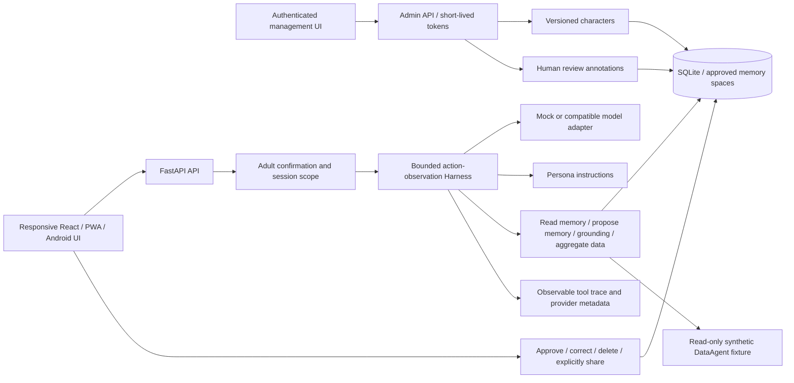

# Architecture

## Turn contract

1. Validate session and message; serialize turns per session.
2. Return an already completed result when the request ID repeats.
3. Check illustrative input policies for crisis, age, and dependency signals.
4. Assemble global rules, frozen fictional persona, approved memories, attributed bounded older excerpts and whole recent message pairs as separate sources.
5. Request a completion; execute only registered tools with validated arguments.
6. Append tool observations and continue until a final reply or a budget failure.
7. Apply illustrative identity/dependency output checks.
8. Atomically persist both messages and safe result metadata. Keep pending structured proposals in expiring process memory.

There is no automatic fallback from a real provider to mock. A failed turn does not create a successful response or partially saved message pair. Pending memory proposals are not persisted if the run fails.

## Memory

History and unapproved suggestions remain session-private. Approved memory belongs to a space that is isolated by default and can be explicitly shared when creating a new conversation. Account mode adds server-side ownership and session restoration after login from another device; it does not automatically share facts across every conversation in the account.

`propose_memory` returns a transient proposal with a 30-minute process-local lifetime. Only explicit approval or a direct user-written save makes it durable and retrievable. User corrections increment a revision. Removing a memory does not erase earlier chat mentions. Deleting a session clears its dialogue; approved memory survives only while another retained session shares its space. See [memory lifecycle](memory.md).

The original message can still be present in recent conversation context before memory approval. Consent controls long-term memory retrieval, not whether the model can read a message the user just sent.

The `skills/` files are lightweight prompt/resource modules loaded by this application. They do not implement dynamic Agent Skills discovery or a portable `SKILL.md` package protocol.

## App and management extension

The mobile UI uses four pages; the desktop UI uses the same backend and a wider layout. Capacitor bundles the presentation assets into an Android project. PWA installation is a separate browser surface, not proof of an APK or store release.

Each session snapshots the selected character name, prompt, greeting, structured bilingual profile and revision. The management plane edits the next revision without rewriting prior session personas. Raw conversations are fetched only after an authenticated administrator explicitly opens a session detail; overview and list endpoints return aggregates/summaries.

The backend retains a local default. Exact remote host/origin configuration requires an additional demo access code, while management requires a separate signed Bearer token. Bootstrap is disabled in remote mode. The code and platform/deployment limits are described in [management](management.md), [device connection](device-connection.md), and [app delivery](app-delivery.md).

## Model and tools

The loop follows an action/observation pattern commonly used in ReAct-style systems, without asking for or logging hidden chain of thought. Tool traces show names, validated inputs, observations, status, and duration. Proposal content uses a consent placeholder. Whole-run failures return an explicit reason and trace without a fake reply or half-turn. Per-tool timeouts yield a visible error observation; synchronous work is bounded and read-only, but a Python thread is not forcefully cancelled.

Registered tools:

| Tool | Permission | Effect |
|---|---|---|
| `read_own_profile` | Frozen session profile only | Read-only fictional identity; no user or alternate-character selector |
| `read_memories` | Explicit memory-space read | Approved memories only |
| `propose_memory` | Proposal only | Requires user approval |
| `grounding_question` | Static resource | Optional nonclinical prompt |
| `session_insights` | Read-only aggregate | Counts and descriptive latency |
| `analyze_demo_data` | Fixed synthetic dataset only | Natural-language plan selection and actual aggregation; query/result provenance |

There are no filesystem, browser, social-account, payment, or messaging tools. Models cannot supply a different session ID or arbitrary SQL through tool arguments.

## Boundaries and limitations

- Age confirmation is a user assertion, not identity verification.
- Keyword rules are illustrative guardrails, not comprehensive moderation.
- Emotional labels are heuristics, not inferred clinical conditions.
- Approved memory and conversations can contain prompt injection; prompts mark them as data, but real-model resistance has not been established.
- UI modes and persona prompts cannot prove relational safety or semantic correctness.
- The single-process SQLite/async-lock design is not a distributed architecture.
- Context uses bounded extractive summaries; omissions are counted and older details can still be lost. These excerpts are session history, never approved cross-session memory.
- Streaming/SSE, forceful tool cancellation, organization SSO/distributed authentication, production hosting, and semantic conflict merging remain outside this controlled milestone.

## Owner lifecycle extension

Account data routes require the current user's bearer token plus current-password reauthentication. Export reads one bounded SQLite snapshot; account erasure removes attributable database and process data atomically where applicable. Late model results recheck owner/session before commit and cannot recreate erased records. The separate administrator remains subject to the owner's review permission. See [data lifecycle](account-data-lifecycle.md) and [disposable backup recovery](data-backup-recovery.md) for exact inventories, retention triggers and retained-copy limitations.

## Character/continuity extension

See [v0.6 design and limits](iteration-2026-10-09-v0.6.md), [identity schema](character-identity.md) and [migration](data-migration.md). A nonempty plain-text output truncated at the provider budget is explicitly labeled as incomplete and its memory proposals are discarded; incomplete tool calls remain failures. This controlled partial response is distinct from an execution failure. No automatic continuation request is sent.
