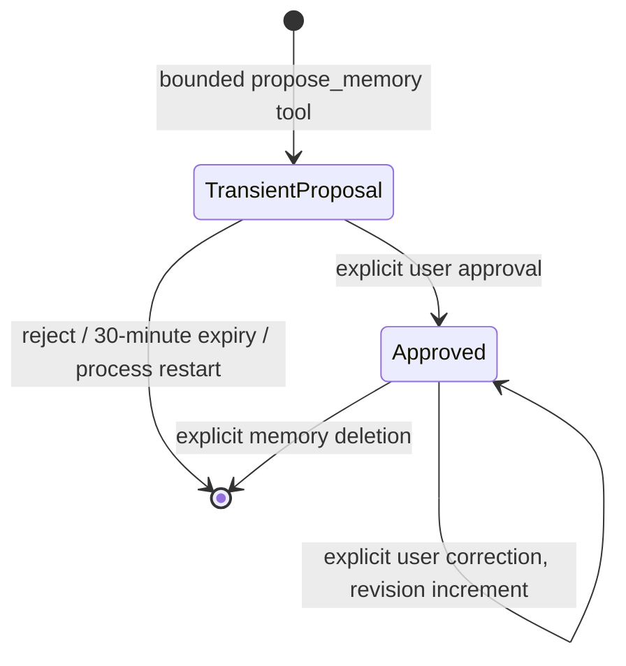

# Consent and memory lifecycle

## Scope

Dialogue history is session-private. Approved structured memory belongs to an opaque memory space. A new conversation receives a fresh space by default. Sharing requires an explicit user selection and a known source session capability (`memory_from_session_id`); only that space's approved facts are shared. Previous messages and pending proposals are not shared.

This is a local/demo capability model, not a multi-device account system. Session handles must be kept private. Production user authentication and ownership checks remain required before public multi-user hosting.

## State transitions

- Pending suggestions exist in process memory only. They are not SQLite memory rows or durable turn-response payloads. Their tool input is represented by a consent placeholder in persisted traces.
- The ordinary input message and final response are still dialogue history. “Not persisted before approval” refers to dedicated structured memory, not a promise to erase an ordinary chat message. Clearing/deleting history is a separate action.
- Approval saves the exact reviewed suggestion; a manually submitted memory form is itself an explicit save action.
- Corrections and deletions affect all conversations sharing that approved-memory space. Default isolated sessions cannot address these memory IDs.
- Editing a pending suggestion becomes an approved memory only with the explicit `approve_pending: true` confirmation; otherwise the correction endpoint refuses the transition. The UI labels this as editing and approving. Approved-memory corrections preserve the existing confirmation boundary.
- Clearing history keeps approved memories and removes messages, turns, human review notes, and this session's pending suggestions.
- Deleting a session removes its dialogue and pending suggestions. Approved memories remain only if another retained session shares their space. Deleting the last session removes the orphaned space and its memories.
- Deleting a memory stops future structured retrieval. Earlier dialogue and historical traces may mention the old fact; they are not rewritten. Clear/delete those conversations separately when required.

## Migration

At startup, existing sessions receive isolated spaces. Legacy approved rows migrate once with their original IDs; legacy pending rows are logically removed. Migration does not establish consent for previously unapproved rows. Filesystem backups or ordinary dialogue may still contain old content; this is not a secure-erasure claim.

## Retry behavior

A completed request ID returns the same run without creating duplicate messages or proposals. Transient proposals are reattached only while they still exist. Reusing an ID for a different message returns HTTP 409. Legacy turns without a request hash cannot be safely verified and also require a fresh request ID instead of an unchecked replay.

## Limits

At most 100 visible memories per session/space, up to three proposals in a turn, content up to 300 characters. Tools read up to ten approved facts; recent context remains bounded and is not semantically summarized. Concurrent/distributed memory consistency and semantic conflict merging are outside this MVP.
